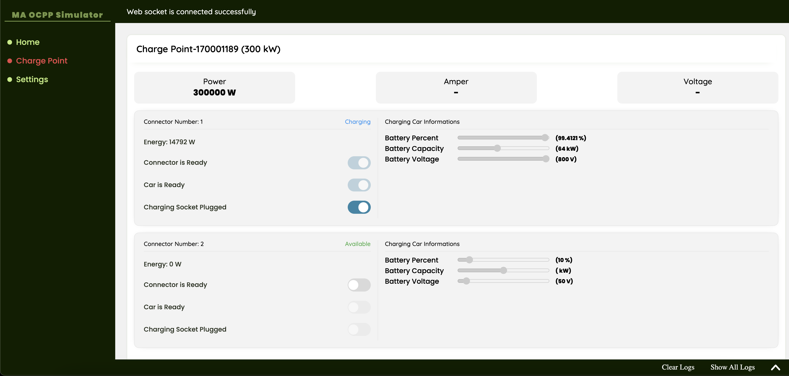

# <h1>Charge Point Simulator</h1>

It is a charge point simulator for testing back-end applications. 



### Running on Docker
First of all clone github project. And open root folder run sh codes.
```sh
# clone project
git clone git@github.com:MuhammedAlmaz/ma-ocpp-simulator.git

# build docker for creating image of application
docker build --tag 'ma-charge-point-simulator' .

# Create container which image you created before
docker run -p 2024:80 -d ma-charge-point-simulator
```

Finnaly, you can open http://localhost:2024 on your browser and the front-end application should running.

### Supported Core Functions
- BootNotification
- Authorize
- StatusNotification
- UnlockConnector
- Heartbeat
- MeterValues
- RemoteStartTransaction
- RemoteStopTransaction
- StartTransaction
- StopTransaction
- ChangeAvailability
- ChangeConfiguration
- GetConfiguration

### Planed Adding Features
- SmartCharging
- Reservation
- Multiple Brand Charging Points (Siemens, Vestel, Trugo, Tesla etc.)
- Store settings and variables on database with back-end application
- Multiple Car Settings (Tesla, TOGG, Xiaomi, Porsche etc.)
- Error Handling like OverVoltage, WeakSignal, HighTemperature etc.

## License
`ma-ocpp-simulator` is open-sourced software licensed under the [MIT license](http://opensource.org/licenses/MIT)
